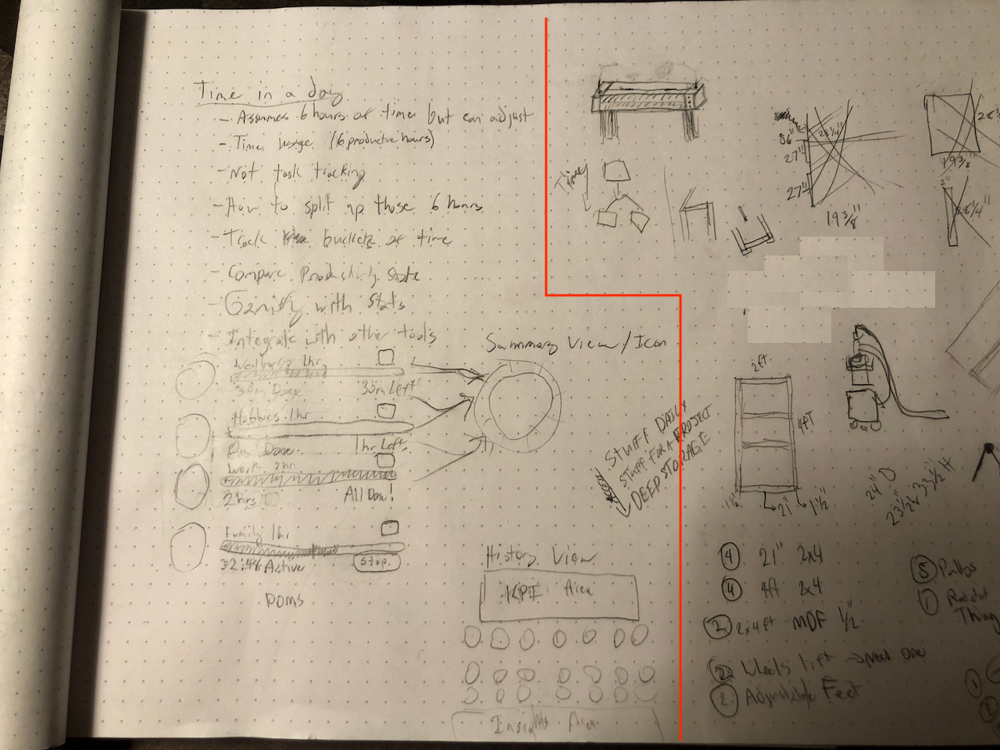
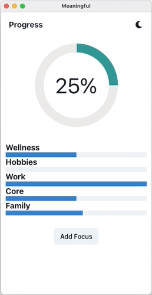

# Meaningful

Make every hour, minute, or second meaningful, make your time spent trackable to keep your focus on the task at hand. Inspired by people like Jack Dorsey who is able to be the CEO of Twitter and Square by [splitting up his work days](https://www.cnbc.com/2020/08/26/twitter-ceo-jack-dorsey-shares-habits-for-focus-and-work-life-balance.html#:~:text=But%20Dorsey%20said%20that%20is,the%20time%20he%20spends%20working.) based on disciplines (Business, Design, Engineering, etc.).

## Background (~1hr challenges)

- I started to give myself ~1 hour challenges to think of an idea, quickly sketch out some designs, and then code what I can within that time.
- It's broken up using pomodoro blocks (25m focus + 5m break = 1 block) starting with 1 block for design and then 1 to 2 blocks for development.

### Design Block (25m focus + 5m break)

Quick design and sketches - really rough... ignore the stuff on the right, just workshop projects and cut lists 😄
<a href="docs/assets/meaningful-design.jpeg" target="_blank" rel="noopener noreferrer"></a>

### Dev Block (30m focus - I skipped the 5m break)

Setting up the project and some quick dev, I felt like I needed another pom block to get some real coding done. This was my first 1 hr challenge so hopefully I'll get better in the future.


## Tech Stack

- This project was quickly scaffolded out using Create React App + Electron + TypeScript + ChakraUI.
- If I were to continue with this project I'd look to substitute out CRA for Vite, ++Storybook, ++Cypress, and setup a CI/CD pipeline with GitHub Actions.

## Getting Started

Clone the repo:

```zsh
git clone https://github.com/retrospct/meaningful.git
```

Install dependencies:

```zsh
cd meaningful
yarn # or npm install
```

Start local development:

```zsh
yarn dev # or npm run dev
```

---

## CRA Generated Stuff

---

This project was bootstrapped with
[Create React App](https://github.com/facebook/create-react-app).

## Available Scripts

In the project directory, you can run:

### `yarn start`

Runs the app in the development mode.<br /> Open
[http://localhost:3000](http://localhost:3000) to view it in the browser.

The page will reload if you make edits.<br /> You will also see any lint errors
in the console.

### `yarn test`

Launches the test runner in the interactive watch mode.<br /> See the section
about
[running tests](https://facebook.github.io/create-react-app/docs/running-tests)
for more information.

### `yarn build`

Builds the app for production to the `build` folder.<br /> It correctly bundles
React in production mode and optimizes the build for the best performance.

The build is minified and the filenames include the hashes.<br /> Your app is
ready to be deployed!

See the section about
[deployment](https://facebook.github.io/create-react-app/docs/deployment) for
more information.

### `yarn eject`

**Note: this is a one-way operation. Once you `eject`, you can’t go back!**

If you aren’t satisfied with the build tool and configuration choices, you can
`eject` at any time. This command will remove the single build dependency from
your project.

Instead, it will copy all the configuration files and the transitive
dependencies (webpack, Babel, ESLint, etc) right into your project so you have
full control over them. All of the commands except `eject` will still work, but
they will point to the copied scripts so you can tweak them. At this point
you’re on your own.

You don’t have to ever use `eject`. The curated feature set is suitable for
small and middle deployments, and you shouldn’t feel obligated to use this
feature. However we understand that this tool wouldn’t be useful if you couldn’t
customize it when you are ready for it.

## Learn More

You can learn more in the
[Create React App documentation](https://facebook.github.io/create-react-app/docs/getting-started).

To learn React, check out the [React documentation](https://reactjs.org/).
